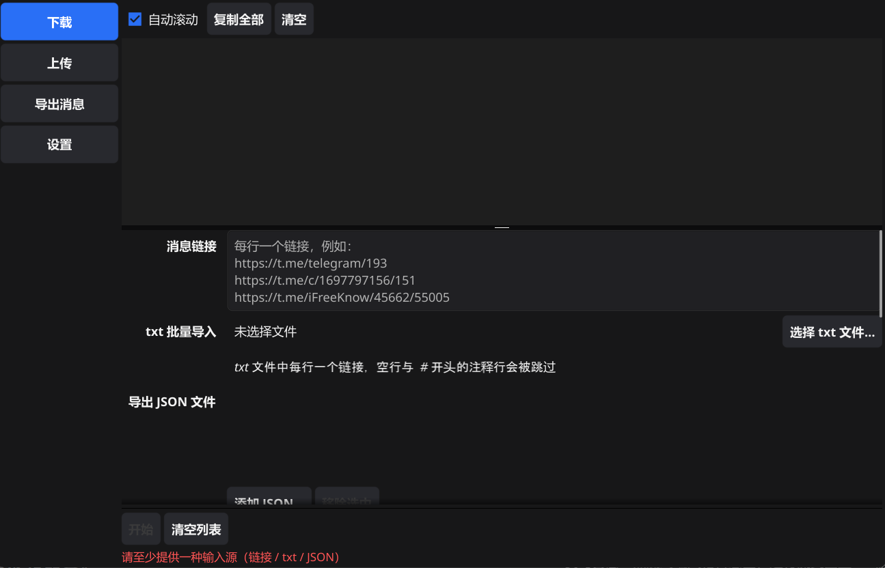
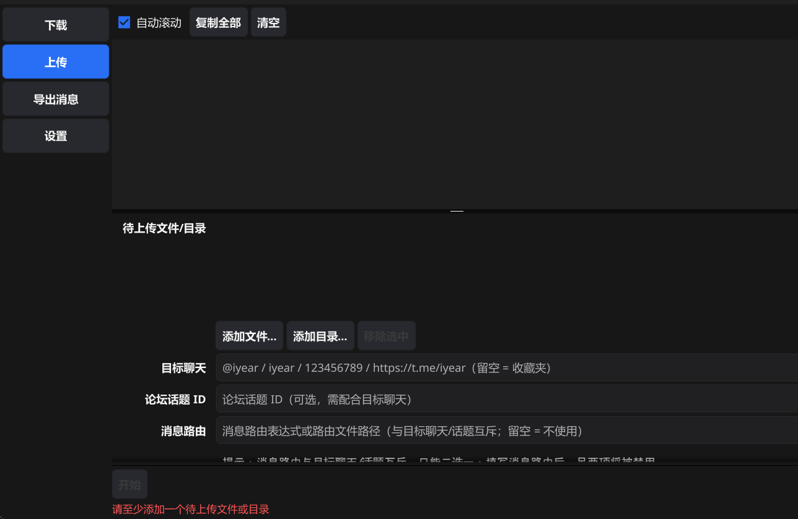
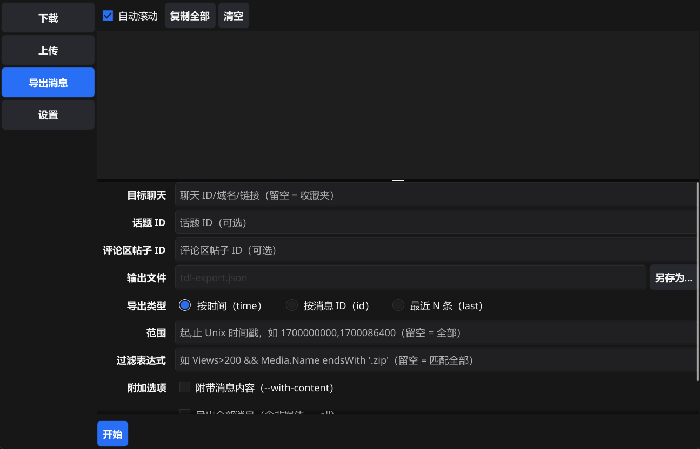

# tdl-GUI

[tdl](https://github.com/iyear/tdl)（Telegram Downloader）的 **Windows 桌面图形前端**。

本项目不重新实现 tdl 的任何功能，只做两件事：把界面表单**拼装成 tdl 命令**，并**运行 `tdl.exe`、实时回显输出**。

> 界面截图：待补充
> 
> 
> 
> <!-- 补图后取消下一行注释并替换为实际路径： -->
> <!--  -->

> **平台限制**：仅支持 Windows。程序依赖 `CREATE_NO_WINDOW`、`CREATE_NEW_CONSOLE`、`taskkill` 等 Windows 特性，暂不支持其他平台。

## 目录

- [tdl-GUI](#tdl-gui)
  - [目录](#目录)
  - [项目简介](#项目简介)
  - [快速使用](#快速使用)
    - [1. 准备 tdl.exe](#1-准备-tdlexe)
    - [2. 启动 tdl-GUI](#2-启动-tdl-gui)
    - [3. 配置 tdl.exe](#3-配置-tdlexe)
    - [4. 登录账号](#4-登录账号)
    - [5. 下载文件](#5-下载文件)
    - [6. 上传文件](#6-上传文件)
    - [7. 导出消息](#7-导出消息)
    - [8. 运行与中止](#8-运行与中止)
  - [基于 tdl 项目](#基于-tdl-项目)
  - [开发语言与技术栈](#开发语言与技术栈)
  - [应用架构](#应用架构)
  - [功能一览](#功能一览)
  - [从源码构建](#从源码构建)
  - [常见问题](#常见问题)
  - [免责声明与致谢](#免责声明与致谢)

## 项目简介

- **无需记忆命令行**：下载、上传、导出消息、登录、全局参数全部图形化配置。
- **实时日志**：黑底终端风格日志区，逐行流式回显 tdl 输出；支持 `\r` 进度行就地刷新、CJK/全角字符对齐、错误红色高亮（缓冲上限 5000 行）。
- **任务可控**：一键【中止】（结束整棵进程树）、任务运行中全局控件锁定、任务运行时关窗二次确认、中止 5 秒看门狗告警。
- **输入校验**：非法输入时【开始】按钮禁用并给出红色原因，所有校验与最终命令共用同一份逻辑。
- **配置持久化**：全局参数与表单调优项自动保存；未完成任务的目标范围（链接/文件列表等）刻意不恢复，避免下次启动误执行。
- **命令回显**：执行前在日志区打印完整命令，登录口令以 `***` 脱敏。

## 快速使用

### 1. 准备 tdl.exe

从 <https://github.com/iyear/tdl/releases> 下载 Windows 版本并解压到任意目录（推荐使用 0.20.4 或与之接近的版本）。

### 2. 启动 tdl-GUI

双击 `tdl-gui.exe`。首次启动时会自动跳转到【设置】页，并提示选择 `tdl.exe` 路径。

### 3. 配置 tdl.exe

进入【设置】页 → 全局参数 → 点击浏览选择 `tdl.exe` 路径 → 点击 `[测试]`。日志区出现 tdl 版本信息，即表示可用。

### 4. 登录账号

【设置】页 → 登录管理 → 点击 `[登录]`，程序会打开一个新的终端窗口：

- 在该窗口中用方向键选择要登录的账号；
- 仅支持 Telegram 桌面客户端方式，客户端需来自 Telegram 官网（非应用商店版）；
- 登录完成后，把本次使用的命名空间填入设置页的【当前命名空间】。

**多账户**：为每个账号使用不同的命名空间（例如 `acc1`、`acc2`），每个命名空间对应一个独立账号/会话。

### 5. 下载文件

【下载】页：粘贴消息链接（每行一条，支持 `https://t.me/...` 与 `tg://`），或通过 txt / JSON 文件批量导入 → 设置下载目录、线程数、并发数 → 选择断点策略 → 点击【开始】。

提示：

- 断点策略请**显式选择**"续传"或"重新开始"：默认模式在检测到未完成任务时会交互询问，而 GUI 子进程无法输入。
- 勾选"重写扩展名"会按文件头 MIME 重写扩展名（例如 `.apk` 可能变为 `.zip`）。
- 大量下载建议开启 Takeout 模式，降低触发 flood wait 的概率。
- txt 导入规则：每行一个链接，空行与 `#` 注释行会被跳过。

### 6. 上传文件

【上传】页：添加文件/目录 → 填写目标聊天（`-c`），如需发到论坛话题再填话题 ID → 可选 captions、扩展名过滤 → 点击【开始】。

提示：勾选"上传后删除本地文件"（`--rm`）删除不可恢复，执行前会二次确认；"消息路由"与"目标聊天/话题"互斥。

### 7. 导出消息

【导出】页：填写目标聊天 → 选择导出类型（按时间 / 按消息 ID / 最近 N 条）与范围 → 选择输出文件 → 点击【开始】。

### 8. 运行与中止

- 任务运行期间，上方日志区实时输出；点击变红的【中止】按钮可强制结束任务（结束整棵进程树）。
- 任务运行时关闭窗口会二次确认，确认后自动中止任务并退出。

## 基于 tdl 项目

- 本项目的全部实际能力均由 [tdl](https://github.com/iyear/tdl) 提供，GUI 仅负责参数拼装与进程运行，**不包含任何 Telegram 协议实现**。
- **需要你自行准备 `tdl.exe`**（本项目不附带）：从 [tdl Releases](https://github.com/iyear/tdl/releases) 下载 Windows 版本，在 GUI 设置页指定其路径。
- 命令参数与默认值对齐 **tdl 0.20.4**（如 `--reconnect-timeout 5m`、`--pool 8`、`--delay 0s`），执行任务时由本项目自动附加。
- 目前覆盖的 tdl 子命令：`login`、`dl`、`up`、`chat export`、`version`。

> 本项目是第三方前端，与 tdl 官方无隶属关系，详见文末[免责声明](#免责声明与致谢)。

## 开发语言与技术栈

| 项 | 内容 |
| --- | --- |
| 开发语言 | Go 1.27.1 |
| GUI 框架 | [Fyne](https://fyne.io/) v2.8.1（原生 OpenGL 窗口，非 WebView） |
| 其他依赖 | [mattn/go-runewidth](https://github.com/mattn/go-runewidth)（日志区宽字符列宽计算） |
| 配置存储 | Fyne Preferences，Windows 通常位于 `%AppData%\fyne\tdl-gui\preferences.json` |
| 支持平台 | 仅 Windows |

## 应用架构

```
tdl-GUI/
├── main.go                      入口：创建 Fyne App、构建窗口、进入事件循环
├── internal/
│   ├── ui/                      界面层（唯一依赖 Fyne 的层）
│   │   ├── app.go               主窗口、左侧导航、日志/页面分栏、首次启动引导、关窗拦截
│   │   ├── task.go              任务状态机：启动/中止/退出码、控件全局锁定、中止看门狗
│   │   ├── logview.go           终端风格日志框：流式输出、进度行覆盖、宽字符对齐、复制/清空
│   │   ├── page_download.go     下载页
│   │   ├── page_upload.go       上传页
│   │   ├── page_export.go       导出消息页
│   │   └── page_settings.go     设置页（全局参数 + 登录管理）
│   ├── cmdgen/                  表单结构体 → tdl 命令行参数，含全部输入校验（零 GUI 依赖）
│   ├── runner/                  子进程生命周期：启动、stdout/stderr 解析、ANSI 剥离、中止进程树
│   ├── store/                   Fyne Preferences 封装，键名规范 `<页面>.<字段>`
│   └── txtload/                 txt 链接列表解析（tdl 原生 `-f` 只接受 JSON）
└── go.mod
```

分层调用关系：

```
ui ──┬─► cmdgen   拼命令 + 校验
     ├─► runner   启动进程 / 解析输出流 / 中止
     ├─► store    读写配置
     └─► txtload  解析 txt 链接文件
```

关键设计：

- **单一校验来源**：界面控件启用状态与最终执行命令由 `cmdgen` 的同一份构建函数产出，避免"界面允许但命令非法"的错位。
- **进程级集成**：不修改、不包装 tdl 源码，只运行 `tdl.exe`；stdout 与 stderr 合并解析，`\r` 视为进度刷新、`\n` 视为完整行。
- **中止即杀树**：使用 `taskkill /T /F` 结束整个进程树，失败时回退强杀，并有 5 秒看门狗告警。
- **登录特殊处理**：`tdl login` 需要交互输入，程序用 Windows `CreateProcess` + `CREATE_NEW_CONSOLE` 新开真实终端窗口运行。
- **输入上限保护**：单次下载链接数上限 800 条，避免触发 Windows 命令行长度上限（约 32K）。

## 功能一览

| 模块 | 能力 |
| --- | --- |
| 下载 `dl` | 多条链接 / txt 批量 / JSON 文件导入；下载目录、线程、并发；断点策略（默认 / 续传 / 重新开始）；扩展名白名单与黑名单；文件名模板；相册分组、跳过同名文件、Takeout、HTTP serve 模式 |
| 上传 `up` | 文件或目录批量上传；目标聊天与论坛话题；消息路由；captions；扩展名过滤；上传后删除本地文件（有二次确认）；照片模式 |
| 导出 `chat export` | 三种导出类型（按时间 / 按消息 ID / 最近 N 条）与范围；过滤表达式；附带内容 / 导出全部 / 原始结构 |
| 登录 `login` | 桌面客户端登录（在新终端窗口内用方向键选择账号）；多账户通过命名空间（`-n`）管理，每个命名空间即一个独立账号 |
| 设置 | tdl.exe 路径、当前命名空间、代理、NTP 服务器、重连超时、DC 连接池、任务间延迟、存储、调试模式、禁用进度遥测；`[测试]` 按钮执行 `tdl version` 验证可用性 |

## 从源码构建

环境要求：Windows + Go 1.27.1 或更高版本。

```powershell
go build -ldflags "-H windowsgui -s -w -X main.version=1.0.0" -o tdl-gui.exe .
```

参数说明：

- `-H windowsgui`：以 GUI 子系统启动，不弹出多余的控制台窗口；
- `-s -w`：去除符号表与调试信息，减小可执行文件体积；
- `-X main.version=1.0.0`：注入版本号，显示在窗口标题 `tdl-GUI <版本>` 中。

运行测试（部分测试会真实启动系统命令，仅 Windows 可用）：

```powershell
go test ./...
```

> 注意：`internal/runner/console_windows.go` 依赖 Windows API，**在其他平台上无法编译**。

## 常见问题

**Q：需要单独安装 tdl 吗？**
需要。本项目不包含 tdl 本体，请自行下载 `tdl.exe` 并在设置页指定路径。

**Q：为什么没有"账号列表 / 切换默认账户 / 登出"按钮？**
当前 tdl 版本（0.20.4）未提供对应命令，因此本页不提供这些按钮。多账户请通过命名空间切换。

**Q：设置页的全局参数会被 tdl 记住吗？**
不会。代理、NTP、连接池等全局参数由本软件在每次执行任务时自动附加，不写入 tdl 自身的配置。

**Q：配置保存在哪里？**
由 Fyne Preferences 管理，Windows 通常为 `%AppData%\fyne\tdl-gui\preferences.json`。其中登录口令以明文保存，请注意本地安全。

**Q：会恢复上次没做完的任务吗？**
不会。任务目标范围类输入（链接、txt/JSON 路径、上传路径、聊天、输出文件等）不做持久化并在启动时清理；其余调优项会自动恢复。

**Q：能转发消息 / 使用 tdl 的其他子命令吗？**
暂不支持。目前仅覆盖 `login`、`dl`、`up`、`chat export`、`version`。

## 免责声明与致谢

本项目是 [tdl](https://github.com/iyear/tdl) 的**第三方图形前端**，非官方项目，与 tdl 作者及 Telegram 官方均无隶属关系。项目不实现 Telegram 协议，也不内置 tdl 本体，所有网络行为与数据处理均由 tdl 完成；使用本软件产生的任何后果由使用者自行承担，请遵守 Telegram 服务条款及当地法律法规。

致谢：

- [iyear/tdl](https://github.com/iyear/tdl)：本项目的全部底层能力来源；
- [Fyne](https://fyne.io/)：Go 跨平台 GUI 框架；
- [mattn/go-runewidth](https://github.com/mattn/go-runewidth)：日志区字符宽度计算。
